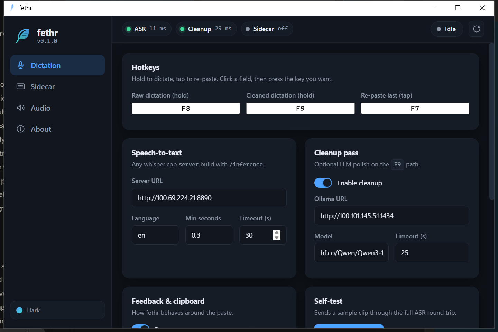
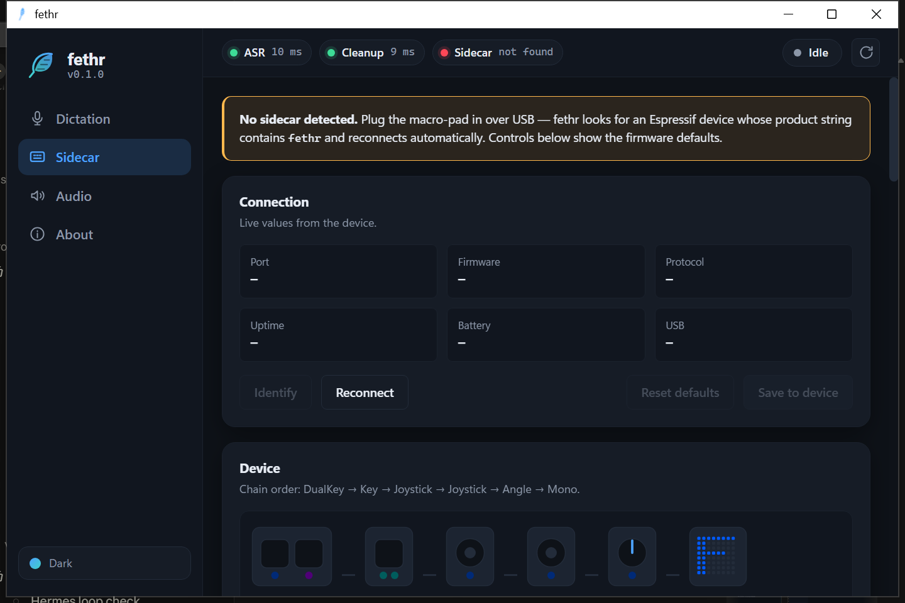

<p align="center">
  
</p>
<p align="center"><strong>Light as a feather, free as your speech.</strong></p>
<p align="center">Push-to-talk dictation for Windows that runs on your own hardware. No account or subscription, and audio never leaves your network.</p>

---

## What it is

fethr is a small tray app. You hold a key, talk, and let go. Whatever you said gets pasted at the cursor in whichever window has focus — editor, browser, chat, terminal, doesn't matter.

The speech recognition runs on a [whisper.cpp](https://github.com/ggml-org/whisper.cpp) server that you host. That can be the same PC, or a box with a GPU somewhere on your LAN or tailnet. There's an optional cleanup pass that sends the transcript through a local LLM on [Ollama](https://ollama.com) to strip filler words, fix punctuation, and apply the "no wait, I meant..." corrections you make while talking.

I built it as a replacement for Wispr Flow. The idea is the same, the difference is that nothing here phones home and there's nothing to pay for.

There's also an optional hardware piece — a little USB macro-pad built from M5Stack Chain modules — covered further down. The app works fine without it.

<p align="center">
  
</p>

## How it works

Three hotkeys, all configurable from the settings window:

| Key | Action | What happens |
|---|---|---|
| **F8** (hold) | raw dictation | Recording starts when you press, stops when you release. Audio goes to whisper.cpp, the text comes back and is pasted. On a modest GPU over a LAN this is well under a second for a sentence. |
| **F9** (hold) | cleaned dictation | Same, plus one round trip through Ollama before pasting. Adds about a second. |
| **F7** (tap) | re-paste | Pastes the last transcript again. Useful when you dictated into the wrong window. |

The paste is a normal clipboard paste (Ctrl+V). Your previous clipboard contents are put back a second later. You get a short beep on press, another on release, and a chirp when the text lands, so you don't have to watch the screen.

Everything runs in one process: the keyboard hooks, the tray icon, and the settings window. The settings window is a local web page rendered in a native window (pywebview) — no browser, no server, no network access at runtime.

Settings live in `%APPDATA%\fethr\settings.json`. You can edit them in the app or by hand.

## Requirements

- Windows 10 or 11
- Python 3.11 or newer (or [uv](https://docs.astral.sh/uv/), which will fetch one for you)
- A whisper.cpp `server` build reachable over HTTP. It needs the `/inference` endpoint, which is the standard one. See [Setting up the server](#setting-up-the-server).
- Optional: an Ollama instance with a model you like for the cleanup pass. I use Qwen3-14B.

## Install

```powershell
git clone https://github.com/malonestar/fethr.git
cd fethr

# with uv
uv venv --python 3.12 .venv
uv pip install --python .venv\Scripts\python.exe -e .

# or with plain Python
python -m venv .venv
.venv\Scripts\pip install -e .

# run it
.venv\Scripts\pythonw.exe -m fethr
```

A feather icon appears in the tray. Left-click it to open the settings window, put your whisper.cpp server URL in the Dictation page, then hold F8 in any text field and talk.

To start it at login:

```powershell
powershell -ExecutionPolicy Bypass -File scripts\install_autostart.ps1 -Python .venv\Scripts\pythonw.exe
```

That drops a shortcut in your Startup folder. `scripts\start_fethr.bat` launches it by hand, and `scripts\kill_fethr.ps1` stops it if the tray icon ever gets stuck.

Pasting into a window that's running as administrator only works if fethr is also running as administrator. That's a Windows rule, not something the app can get around.

## Setting up the server

Any whisper.cpp `whisper-server` works. The one I run:

- model `ggml-large-v3-turbo-q8_0.bin` (about 1 GB of VRAM, fast, accurate enough that I rarely use the cleanup pass)
- started with `--convert` so it accepts m4a and other formats, not just WAV
- bound to a port fethr can reach (`--host 0.0.0.0 --port 8890`)

`server/setup_whisper_vulkan.sh` is the script I used to build it on a Linux box with an AMD GPU (Vulkan backend, no root needed). `server/whisper-flow.service` is the matching user-level systemd unit. If you're on NVIDIA, build whisper.cpp with CUDA instead — the server command line is the same.

For the cleanup pass, install Ollama, pull a model, and put the URL and model name in the Cleanup card. The prompt it uses is in `fethr/core/dictation.py` if you want to change how it edits.

## iPhone

There's no iOS app, but a Shortcut gets you most of the way: record, send to the same whisper server over your tailnet or VPN, copy the result to the clipboard. Setup is in [docs/IPHONE_SHORTCUT.md](docs/IPHONE_SHORTCUT.md). iOS doesn't let a third-party app type into other apps, so it's record → paste rather than record → text appears.

## The hardware layer: the sidecar

<p align="center">
  
</p>

The sidecar is a small desk device built from [M5Stack Chain](https://docs.m5stack.com/en/chain/Chain_DualKey) modules. The brain is a [Chain DualKey](https://shop.m5stack.com/products/chain-dual-key-with-esp32-s3) — an ESP32-S3 with two mechanical keys, RGB LEDs, a battery, and USB/BLE. The other modules daisy-chain off it over a UART bus:

| Module | What it does in fethr |
|---|---|
| [Chain DualKey](https://docs.m5stack.com/en/chain/Chain_DualKey) | Key 1 held = raw dictation, Key 2 held = cleaned. LEDs show each key's function and go red while you're recording. |
| [Chain Key](https://docs.m5stack.com/en/chain/Chain_Key) | Tap = re-paste. Double-tap = undo the paste. |
| [Chain Joystick](https://docs.m5stack.com/en/chain/Chain_Joystick) ×2 | One is arrow keys and Enter, the other is scroll wheel and middle click. |
| [Chain Angle](https://docs.m5stack.com/en/chain/Chain_Angle) | Volume knob. |
| [Chain Mono](https://docs.m5stack.com/en/chain/Chain_Mono) | 8×8 LED panel. Mic while you're recording, a spinner while the server is working, a check when the text lands, a volume bar when you turn the knob. |

You don't need all of them. The firmware finds whatever is plugged in and skips what isn't. The DualKey alone gets you the two dictation keys.

To the PC it's just a USB keyboard and mouse, so it works without fethr running at all — the keys send F8/F9/F7 like any keyboard would. What fethr adds is a settings channel over the same USB cable: the Sidecar page shows what's plugged in, lets you change LED colours, panel brightness and hold timings, and tells the device when a transcript has actually landed so the panel can show it. Changes apply immediately and can be saved to the device.

The stock M5Stack firmware can't do this — it only offers a fixed list of paired shortcuts and has no notion of holding a key down — so the sidecar runs its own firmware. This first release ships one layer (dictation). The source has more layers (media keys, edit shortcuts, mouse mode) behind a build flag; they'll be turned on once the first layer has been through real use.

**Flashing.** You don't need a toolchain. Prebuilt images are in `hardware/bin/`, and [hardware/FLASH.md](hardware/FLASH.md) walks through it: put the DualKey in download mode (it has no reset button — switch to middle, hold Key 1, plug in), then flash with Espressif's browser flasher or `esptool`. Building from source is a PlatformIO project in `hardware/firmware/pio/`; notes on what's been verified against real hardware are in [hardware/README.md](hardware/README.md). The serial protocol between the device and the app is in [hardware/PROTOCOL.md](hardware/PROTOCOL.md).

Once it's flashed, turn on **Enable sidecar** in the app's Sidecar page. With it off, fethr never touches a serial port.

## Repo layout

```
fethr/            the app (Python package)
  core/           dictation engine, settings, sidecar serial bridge, audio
  ui/             settings window (pywebview) + the HTML/CSS/JS it shows
  assets/         logo sources and generated icons (build_logo.py)
scripts/          launcher, autostart installer, kill switch
server/           whisper.cpp server build script + systemd unit
hardware/         macro-pad firmware (PlatformIO), protocol, hardware notes
docs/             images, iPhone Shortcut setup
tests/            pytest — runs without a mic, GPU or device
```

## Status

- Dictation: in daily use.
- Settings app: working, tested on Windows 11.
- Sidecar firmware: first layer (dictation) — compiles clean, hardware bring-up in progress. The unknowns are listed in the firmware notes. More layers after that.
- macOS/Linux: not supported yet. The engine is mostly portable; the keyboard hook and paste injection are the Windows-specific parts.

## Contributing

Issues and pull requests are welcome. Run `pytest` before opening a PR — the tests don't need hardware. If you change anything in the UI, `python -m fethr --smoke` should still exit 0.

## License

MIT. See [LICENSE](LICENSE).
